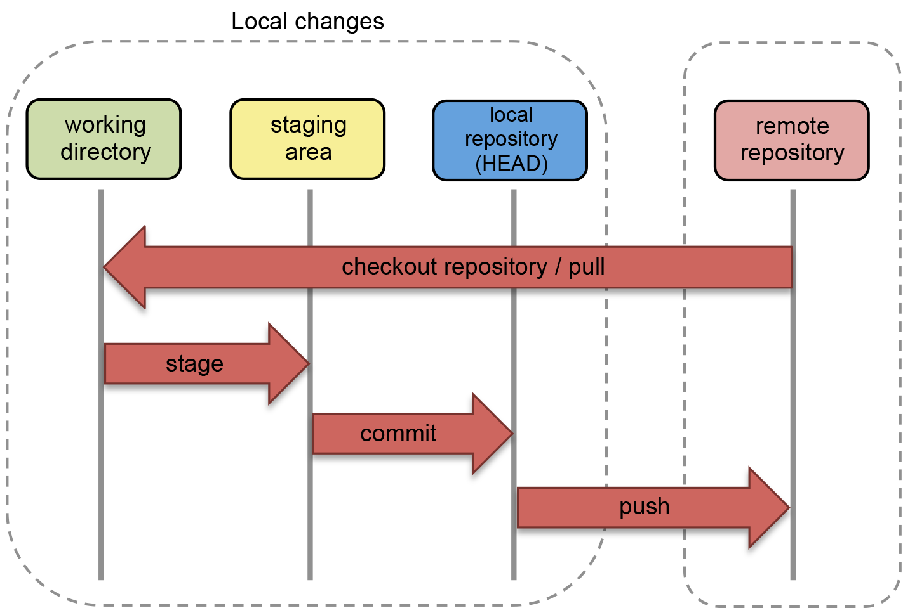

# Introduction to Git / GitHub

For your assignments you will work in groups of 3-4 people using GitHub Classroom. Therefore we will give you a **brief** introduction to Git / GitHub that you can start right away.
If you are interested in learning more about Git / GitHub there are several good tutorials that you can watch in addition.

## 1. Install git and create a github account (if you haven't done yet)

### 1.1 Installing Git

- Linux (Debian):
  ```sh
  sudo apt-get install git
  ```
- Linux (Fedora):
  ```sh
  sudo yum install git
  ```
- Mac: https://git-scm.com/download/mac  
- Windows: https://git-scm.com/download/win

### 1.2 Creating GitHub account

- sign up at www.github.com
- free for public repositories

### 1.3 Configuring Git

To tell Git who you are, set your username and email address in your terminal. Any changes pushed to GitHub will include this information.

```sh
git config --global user.name "[username]"
git config --global user.email "[email address]"
```


## 2. Workflow



### 2.1 Checkout a repository

You can clone your repository on GitHub to create a local copy on your computer and sync between the two locations. Repositories consist of a collection of all files and the history of those files.

1. On GitHub copy clone URL for the repository.
2. Open terminal.
5. Change the current working directory to the location where you want the cloned directory to be made.
6. Type `git clone`, and then paste the URL you copied in Step 2.
   ```sh
   git clone <URL>
   ```
<div class="page-break" />

### 2.2 Staging and Committing code

For staging a certain modified file or to stage all changes inside your project folder use:

```sh
git add <file>
git add -A
```

For committing staged files to the local repository with a commit message use:

```sh
git commit -m "commit message"
```

Alternatively you can directly commit all changes to the local repository with a commit message:

```sh
git commit -a -m "commit message"
```
Enter a relevant commit message to indicate what code changes were done in that particular commit!

### 2.3 Pushing and Pulling

In order to push all the code from the local repository into the remote repository use:

```sh
git push <remote> <branch>
```

In order to pull the latest changes from the remote repository into the local repository use:

```sh
git pull <remote> <branch>
```

page-break
### 2.4 Branching and Merging

Multiple branches are needed to support multiple parallel developments. This will be an important part when working on your homework.


To create a new branch based upon your current HEAD branch use:

```sh
git branch <new-branch>
```

After creating a new branch you have to switch to it (since you are still in the master branch):

```sh
git checkout <new-branch>
```

After committing some changes to the new branch all the code in the new branch can be brought back to the master branch using:

```sh
git checkout master
git merge <new-branch>
```

At best there are no conflicts after merging, but you will run sooner or later into conflicts when a merge is being done.

Resolving the conflict is something which comes with experience, so as you work more with Git you will be able to get the hang of resolving conflicts.
